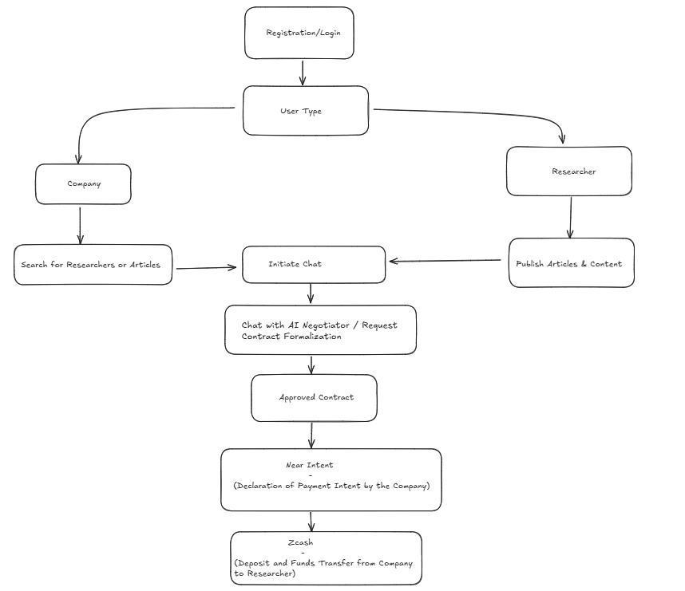

# Nexus Research

## 1. 🌎 Overview

**Nexus Research** connects **innovative companies** with **specialized researchers** across various strategic fields. Our platform enables direct partnerships with **integrity assurance**, **intellectual property protection**, and **automated blockchain-based compensation**.

---

## 2. 🚧 Identified Problem

- **Difficulty in Connecting Talent:**  
  - Companies face challenges finding specialized researchers, as many talents struggle to position themselves in the market. According to the study *"Getting an Academic Research Position: Challenges Faced by Researchers"* (Springer Nature), 75% of researchers find it difficult to secure a position, and 52% cite identifying opportunities as one of the biggest obstacles. These findings highlight a mismatch between available talent and market demands, impeding effective connections between companies and researchers.  
  - Companies report difficulties locating relevant academic expertise.

  **Reference:**  
  [Getting an Academic Research Position: Challenges Faced by Researchers](https://www.springernature.com/gp/librarians/the-link/blog/blogposts-news-initiatives/getting-an-academic-research-position/25475206)

- **Devaluation of Academic Knowledge:**  
  - Due to the systemic devaluation of academics—evidenced by stagnant wages, precarious contracts, and heavy reliance on adjunct work—only a small fraction of researchers can transform their knowledge into sustainable income streams. This reality reflects an erosion in the value attributed to research, where intellectual effort rarely translates into adequate compensation.

  **Reference:**  
  [Reckoning with the Devaluation of Academic Knowledge and Research](https://academeblog.org/2025/02/13/reckoning-with-the-devaluation-of-academic-knowledge-and-research/)

- **Challenges in Ensuring Originality:**  
  - Studies using automated tools like iThenticate have found that about 18% of submissions exhibit significant similarity levels (over 20% matching), indicating persistent challenges in maintaining originality and proper source attribution in academic work.

  **Reference:**  
  [Scientific misconduct: Plagiarism and non-compliance with disclosure of interest](https://www.sciencedirect.com/science/article/pii/S1877056823001548)

- **Risks in Privately Funded Partnerships:**  
  - The growing influence of industry funding has led to restrictive agreements on the disclosure of research findings. Research indicates that many consultancy contracts are not adequately reviewed by institutions, resulting in weak contractual structures and increased legal and ethical risks associated with informal partnerships.

  **Reference:**  
  [When big companies fund academic research, the truth often comes last](https://www.ncbi.nlm.nih.gov/pmc/articles/PMC9039120/)

*This gap between industry and academia limits innovation and competitiveness, underlining the need for a robust solution.*

---

## 3. 💡 Value Proposition

Nexus Research integrates **connection**, **security**, and **automation** to create innovative partnerships using cutting-edge technologies:

### ✅ Fast and Targeted Connection
- **Smart Matching:** Companies can find specialized researchers through an intuitive interface, reducing the time between identifying a need and initiating collaboration.

### ✅ Security and Data Integrity
- **Blockchain:** Publication of articles and agreements is recorded on the blockchain to ensure intellectual property protection and prevent plagiarism.  
- **Negotiation AI:** Automated contract generation ensures transparency and legal security.

### ✅ Process and Payment Automation
- **Near Intents:**  
  - **Speed:** Converts interactions into verifiable blockchain actions.  
  - **Integration:** Formalizes agreements directly within the app flow (e.g., via chat).  
  - **Auditable Security:** Every action is immutably recorded.

- **Zcash:**  
  - **Secure Transactions:** Executes payments with high privacy using zero-knowledge proofs.  
  - **Automation:** Releases funds automatically to the researcher upon meeting contractual terms.  
  - **Integrity:** Transactions are documented and auditable on the blockchain.

---

## 4. 🎯 Customer Segments

### 1. Innovative Companies
- **Sectors:** Clean Energy, Technology, Biotechnology, AI, Sustainability, and more.  
- **Needs:**  
  - Strategic access to specialized experts.  
  - Secure and agile formalization of partnerships.  
- **Example:** An electric mobility company seeking a specialist in battery technology and energy management systems to enhance vehicle performance and safety.

### 2. Researchers and Specialists
- **Profile:** Academics, professors, and authors of scientific publications.  
- **Needs:**  
  - Visibility and monetization of their knowledge.  
  - Intellectual property protection and plagiarism prevention.  
- **Example:** A biotechnology researcher aiming to apply and monetize their studies through industry partnerships.

---

## 5. 🔄 User Flow

1. **Registration/Login:**  
   Users sign up or log in to the platform.

2. **User Type Selection:**  
   - **Company:** Searches for researchers and relevant articles.  
   - **Researcher:** Publishes articles and technical content.

3. **Initiating Conversation:**  
   The company contacts the researcher via chat to discuss a partnership.

4. **Negotiation and Contracting:**  
   AI facilitates the negotiation and automatically generates a contract based on the agreement.

5. **Formalization and Payment:**  
   - **Near Intents:** Formalizes the payment intention via smart contracts.  
   - **Zcash:** Executes the payment with complete privacy; funds are automatically released to the researcher upon contract fulfillment.

  Figure 1 – User Flow at Nexus Research  
  
  Source: Material produced by the authors (2025).

---

## 6. ⚙️ Key Features

- **Registration and Profiles:**  
  Creation of accounts for companies and researchers with defined areas of interest and expertise.

- **Content Publication:**  
  Researchers publish articles registered on the blockchain to verify authorship.

- **Chat with Negotiation AI:**  
  Real-time communication for goal alignment and automated contract generation.

- **Formalization via Near Intents:**  
  Declaration of payment intention and recording of agreements in smart contracts.

- **Zcash Transactions:**  
  Automated payments with high privacy and security, released as per contract terms.

---

## 7. 💰 Estimated Pricing for Researchers/Consultants

### A. Entry-Level/Academic Consultants
- **Characteristics:**  
  Solid academic background (Master's or PhD) with initial consulting experience.  
- **Scope:**  
  Projects of lower complexity (data analysis, market research).  
- **Price Range:**  
  - **Hourly:** R$ 50 to R$ 200  
  - **Daily:** R$ 400 to R$ 1,600

### B. Experienced/Specialized Consultants
- **Characteristics:**  
  Proven experience and expertise in specific areas.  
- **Scope:**  
  More complex projects, detailed diagnostics, and personalized strategies.  
- **Price Range:**  
  - **Hourly:** R$ 200 to R$ 500  
  - **Daily:** R$ 1,600 to R$ 4,000

### C. Renowned/Highly Specialized Consultants
- **Characteristics:**  
  Recognized leaders with a history of high-impact work.  
- **Scope:**  
  Strategic high-level projects (restructuring, international expansion).  
- **Price Range:**  
  - **Hourly:** Above R$ 500  
  - **Daily:** Above R$ 4,000

---

## 8. 💵 Platform Monetization

### 1. Brokerage Fee
- **Model:**  
  A percentage or fixed fee is charged on each formalized consulting contract.
- **Objectives:**  
  - Generate recurring revenue based on transaction volume.  
  - Encourage secure, auditable formalization of partnerships.

### 2. Monthly Subscription Plans
- **For Companies:**  
  - Priority access to consultants through the recommendation system.  
  - Analytical reports, market insights, and contract management tools.
- **For Researchers:**  
  - Increased visibility and profile highlighting on the platform.  
  - Exclusive performance analysis tools and premium functionalities.
- **Objective:**  
  Retain users with recurring monthly/annual revenue and drive platform growth.

### 3. Advertising and Strategic Partnerships
- **Advertising:**  
  - Targeted ads aimed at audiences interested in innovation and technology.
- **Strategic Partnerships:**  
  - Collaborations with universities, research centers, and technology companies for events and workshops.
- **Objective:**  
  Diversify revenue sources and expand the platform's reach.

---

## 9. 🔥 Nexus Research Differentiators

- **Blockchain-registered article publication to verify authorship.**  
- **AI-moderated smart contract chat.**  
- **Genuine integration between academia and corporate innovation.**

---

## 10. 🚀 Next Steps

### 1. AI-Integrated Escrow System
**Objective:** Ensure payments (ZEC) are automatically released only after verifying compliance with contract terms.
- **Development:**  
  - Create smart contracts to hold funds during the contract period.  
  - Integrate the escrow module into the platform for automated transactions.
- **AI Integration:**  
  - Develop an algorithm to evaluate interactions and deliverables.  
  - Define clear criteria for contract fulfillment validation.  
  - Automate the release of ZEC upon AI approval.

### 2. Matching Recommendation System
**Objective:** Facilitate the identification of ideal partnerships.
- **Development:**  
  - Implement an algorithm that analyzes profiles, areas of expertise, and interaction history.
- **Integration:**  
  - Display recommendations on user dashboards.  
  - Enable continuous feedback to refine the system.

### 3. Additional Features and Improvements
**Objective:** Enhance user experience and reinforce transparency.
- **Negotiation AI Chat:**  
  Refine the interface and ensure secure storage of conversation histories.
- **Monitoring and Feedback:**  
  Implement post-contract feedback modules for continuous improvement.
- **Testing and Validation:**  
  Conduct beta tests and iterate based on feedback to ensure efficient system integration.

---

## 11. 🛠️ Core Technologies

### 🔹 Frontend
- React, Vite, TailwindCSS, Socket.IO, React Router

### 🔹 Backend
- Express.js, Axios, Near-api-js, web3.storage, Multer

### 🔹 Blockchain
- Near Protocol, Near Intents, Zcash

---

## 🙋 Who We Are

We are a group of technology students and enthusiasts, passionate about innovation and dedicated to bringing academic knowledge to market in practical ways. With backgrounds in technology, we combine our expertise in research, system development, and artificial intelligence to create solutions that bridge the gap between companies and researchers. Our goal is to turn ideas into real projects, driving innovation collaboratively, transparently, and accessibly.

### 👥 Our Team

  
<table>
  <tr>
    <td align="center">
      
       
      <b>Giovanna Vieira</b> 
      Computer Scientist
    </td>
    <td align="center">
      
       
      <b>Marcos Peixoto</b> 
      Software Engineer
    </td>
    <td align="center">
      
       
      <b>Daniel Augusto</b> 
      Software Engineer
    </td>
    <td align="center">
      
       
      <b>Matheus Ribeiro</b> 
      Software Engineer
    </td>
  </tr>
</table>

